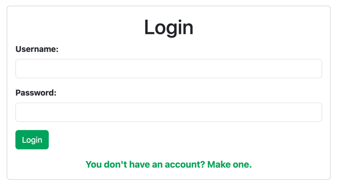
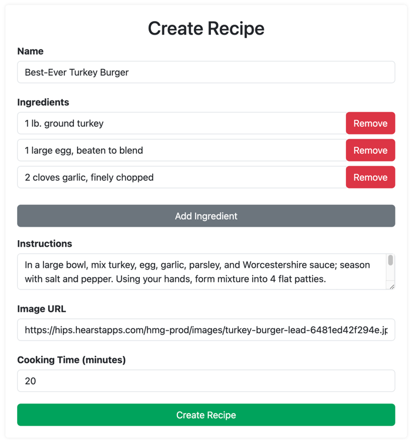

# MERN Stack Recipe App

## Description

This is a simple recipe app built using the MERN stack. It allows users to create recipes
and save them to their favourite one.

The user can create an account and log in to the app. 



Once logged in, the user can create recipes by clicking on the "Create Recipe" button,
and filling in the form.



Then the user can browse all the recipes, and save them to their favourite ones by clicking
on the "Save" button.

## Installation

To install the client side, run the following commands:

```
cd client
npm install
```

To install the server side, run the following commands:

```
cd server
npm install
```

Inside the server folder, create a .env file and add the following variables:

```
DB=<your_mongo_uri>
SECRET=<your_jwt_secret>
PORT=4000
```

## Usage

To start the client side, run the following commands:

```
cd client
npm start
```

To start the server side, run the following commands:

```
cd server
npm start
```

## License

This project is licensed under the MIT license.

## Contributing

To contribute to the project, please contact me.